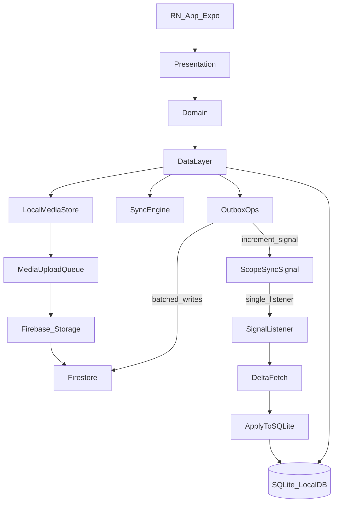

# Target System Architecture (Expo + Firebase, Local‑First)

This doc defines the **high-level architecture** for the Firebase + React Native (Expo) migration:

- **Local-first correctness**: UI reads/writes **SQLite only**
- **Collaboration without read amplification**: **1 tiny listener per active scope** (project *or* business inventory) on a signal doc, then **delta fetch**
- **Explicit durability**: outbox, cursors, conflict records are persisted locally

For the detailed sync engine mechanics (cursors, tombstones, signal doc fields, conflict policy notes), treat this as canonical:

- [`sync_engine_spec.plan.md`](../sync_engine_spec.plan.md)

---

## Architectural invariants (non-negotiable)

These invariants are repeated across the doc set; they are the reason this architecture exists:

- **UI ↔ local DB only** (no screen code talking directly to Firestore)
- **No large listeners** (no subscribing to entire `items`, `transactions`, etc.)
- **Delta sync** via `updatedAt` cursor and stable ordering
- **Explicit outbox** with idempotency via `lastMutationId`
- **Server-owned invariants** via callable Functions for multi-doc correctness

---

## System diagram (layers + data flow)

### Primary data path (foreground SLA path)

### Firebase services used (and why)

- **Firebase Auth**: identity + session; integrates Google + email/password + invite acceptance
- **Firestore**: canonical entity docs, plus a tiny per-project `meta/sync` signal doc
- **Firebase Storage**: receipts/images/PDFs (resumable uploads; attach metadata in Firestore)
- **Cloud Functions (callable)**:
  - multi-doc operations that must be atomic/correct
  - operations that would be unsafe/expensive to express in rules
  - optional “backstop” triggers (not the latency-critical path)

---

## Data ownership model (what is “source of truth”)

### Device source of truth

- **SQLite is the canonical state for the UI**
- Every screen renders from SQLite queries
- Every user action writes SQLite first (in a transaction) and enqueues an outbox op

### Cloud source of truth

- Firestore is the **canonical shared state across devices**
- Devices converge on Firestore via:
  - **Outbox flush** (write path)
  - **Delta fetch** (read path)

### Derived state

- Derived/rollup fields that require multi-doc correctness are **server-owned**
- Clients can display locally-derived previews, but server writes decide the canonical values

---

## Runtime lifecycle (foreground vs background)

This architecture intentionally treats foreground as the “SLA path” and background as best-effort.

### App cold start

1. **Boot**: initialize logging/error boundaries
2. **Auth bootstrap**: restore Firebase Auth session
3. **Local DB init**: open SQLite, run migrations, load minimal caches (account context, last active scope)
4. **Hydrate UI** from SQLite immediately (offline-first)
5. If online and a scope is active (project or inventory):
   - run **one foreground delta pass**
   - attach the **single** signal listener for that active scope
   - start outbox flush loop (foreground)

### App background

- Stop the scope signal listener
- Pause/suspend outbox flush (optional “best effort” background execution if platform allows)
- Persist scheduler + cursors + last-known statuses

### App resume

1. Run one delta pass immediately (catch-up)
2. Reattach the single signal listener for the active scope
3. Resume outbox flush loop

---

## Module boundaries (so features don’t leak infra)

### Presentation layer

Responsibilities:

- navigation, forms, rendering, user interactions
- subscribes to **query hooks** fed by SQLite reads
- calls **mutations** that write SQLite + enqueue outbox ops

Forbidden:

- any direct Firebase SDK usage (Firestore/Storage/Auth) beyond auth bootstrap glue

### Domain layer

Responsibilities:

- pure business rules (validation, derived fields, computation rules)
- conflict policies (what fields are “critical”, what can auto-resolve)

Properties:

- deterministic and testable (no network/local storage)
- portable to web/desktop later

### Data layer (the only place that knows persistence/network)

Responsibilities:

- SQLite schema + migrations
- outbox table + dispatcher
- sync engine (delta fetch + apply; change-signal listener)
- media storage + upload queue
- adapters for Firebase Auth/Firestore/Storage + Functions callables

Public surface area (example, not final API):

- `query*` (SQLite read APIs)
- `mutate*` (SQLite write + enqueue outbox)
- `startProjectSync(projectId)`, `stopProjectSync()`
- `triggerForegroundSync()`
- `getSyncStatus()` (pending ops counts, last delta run timestamps, last error)

---

## Key design choices (and the “why”)

### Why only one listener (signal doc)?

- Cost control: prevents “subscribe to all items/transactions” read amplification
- Predictable performance: delta fetch returns only docs that changed since cursor
- Clear offline UX: local-first with explicit sync state is understandable

### Scope note: Projects vs Business Inventory

Business Inventory is not a project. It is its own scope, represented by `projectId = null` in your existing model.

The architecture therefore supports **two signal docs**:

- Project signal: `accounts/{accountId}/projects/{projectId}/meta/sync`
- Inventory signal: `accounts/{accountId}/inventory/meta/sync`

### Why explicit outbox instead of Firestore client persistence?

- You need durable, inspectable state for:
  - queued ops + retries
  - idempotency (`lastMutationId`)
  - conflict detection and resolution UI
- It matches the existing web app’s offline architecture and constraints

### Why callable Functions for some writes?

- Some operations are inherently multi-doc and must be correct:
  - inventory allocation/sale flows
  - lineage pointers
  - rollups/totals that must match canonical state
- Firestore rules cannot express complex invariants safely; callables can

---

## Cross-platform trajectory (without overbuilding now)

- **Now**: iOS with Expo (fast iteration)
- **Later**: Android with Expo (keep native-module footprint low)
- **Optional**:
  - Web via React Native Web (requires a compatible local persistence strategy)
  - macOS “easy mode” by wrapping a web build once/if web exists

---

## Related docs (this doc’s dependencies)

- Sync engine: [`sync_engine_spec.plan.md`](../sync_engine_spec.plan.md)
- Data model: [`../20_data/firebase_data_model.md`](../20_data/firebase_data_model.md)
- Local schema: [`../20_data/local_sqlite_schema.md`](../20_data/local_sqlite_schema.md)
- Security model: [`security_model.md`](./security_model.md)
- Offline UX principles: [`offline_first_principles.md`](./offline_first_principles.md)
