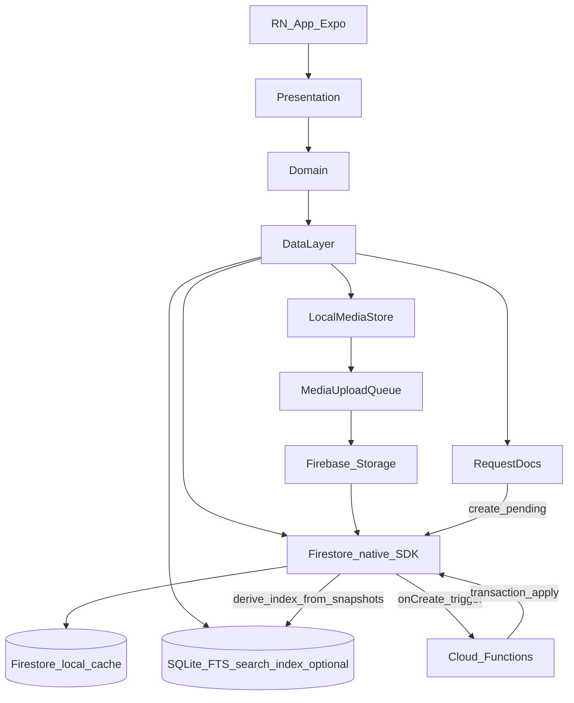

# Target System Architecture (Expo + Firebase, Local‑First)

This doc defines the **high-level architecture** for the Firebase + React Native (Expo) migration:

- **Offline-ready baseline**: Firestore-native offline persistence (“local cache + queued writes”)
- **Collaboration without read amplification**: **scoped listeners** only (bounded queries per active scope)
- **Multi-doc correctness**: request-doc workflows (Cloud Function applies atomically)
- **Optional offline search**: small SQLite/FTS index, derived from Firestore, rebuildable

Canonical offline-data direction for this repo lives at:

- [`OFFLINE_FIRST_V2_SPEC.md`](../../../../OFFLINE_FIRST_V2_SPEC.md)

---

## Architectural invariants (non-negotiable)

These invariants are repeated across the doc set; they are the reason this architecture exists:

- **Firestore-native offline is the baseline** (no bespoke sync engine/outbox/cursors)
- **No unbounded listeners** (no “listen to everything” across accounts/projects)
- **Scoped listeners only** (active scope, bounded queries, lifecycle-managed)
- **Request-doc workflows** for multi-doc operations and critical invariants
- **SQLite is index-only** (optional, rebuildable, never authoritative)

---

## System diagram (layers + data flow)

### Primary data path (foreground SLA path)

### Firebase services used (and why)

- **Firebase Auth**: identity + session; integrates Google + email/password + invite acceptance
- **Firestore**: canonical entity docs; offline persistence provides cache + queued writes
- **Firebase Storage**: receipts/images/PDFs (resumable uploads; attach metadata in Firestore)
- **Cloud Functions (callable)**:
  - multi-doc operations that must be atomic/correct
  - operations that would be unsafe/expensive to express in rules
  - optional “backstop” triggers (not the latency-critical path)

---

## Data ownership model (what is “source of truth”)

### Device source of truth

- **Firestore local cache is the canonical state for the UI**
- Every screen renders from Firestore reads (cache-first or cache-aware, depending on posture)
- Every user action writes Firestore first (single-doc where possible)

### Cloud source of truth

- Firestore is the **canonical shared state across devices**
- Devices converge via:
  - Firestore sync (queued writes + remote updates)
  - scoped listeners (bounded to the active scope)

### Derived state

- Derived/rollup fields that require multi-doc correctness are **server-owned**
- Clients can display locally-derived previews, but server writes decide the canonical values

### Optional derived search index

- SQLite is permitted for a **derived search index** (e.g., FTS for offline item search).
- The search index is **non-authoritative** and must be rebuildable from Firestore-cached data.
- Search returns candidate IDs; item details still come from Firestore.

---

## Runtime lifecycle (foreground vs background)

This architecture intentionally treats foreground as the “SLA path” and background as best-effort.

### App cold start

1. **Boot**: initialize logging/error boundaries
2. **Auth bootstrap**: restore Firebase Auth session
3. **Firestore init**: ensure persistence is enabled (native SDK) and app is ready for cache-first reads
4. **Hydrate UI** from Firestore cache immediately (offline-first)
5. If a scope is active (project or inventory):
   - attach scoped listeners for that scope (bounded queries)
   - if offline search is enabled, open SQLite and (re)build/refresh the derived index from snapshots

### App background

- Detach scoped listeners (or reduce to minimal “essential” listeners if justified)
- Pause best-effort background work (uploads, rebuild jobs)
- Persist last-known statuses

### App resume

1. Reattach scoped listeners for the active scope
2. Resume uploads / index refresh jobs as needed

---

## Module boundaries (so features don’t leak infra)

### Presentation layer

Responsibilities:

- navigation, forms, rendering, user interactions
- subscribes to state derived from Firestore listeners / reads (through the data layer)
- calls mutations that write Firestore (through the data layer)

Forbidden:

- direct Firebase SDK usage scattered across screens; keep Firebase usage in the data layer (auth bootstrap glue in a single place is fine)

### Domain layer

Responsibilities:

- pure business rules (validation, derived fields, computation rules)
- conflict policies (what fields are “critical”, what can auto-resolve)

Properties:

- deterministic and testable (no network/local storage)
- portable to web/desktop later

### Data layer (the only place that knows persistence/network)

Responsibilities:

- Firestore data access (native SDK), query scoping, and listener lifecycle
- request-doc helpers (create request docs; observe status)
- optional SQLite schema + migrations for the **search index only**
- media storage + upload queue
- adapters for Firebase Auth/Firestore/Storage + Functions callables

Public surface area (example, not final API):

- `subscribe*` / `query*` (Firestore reads + listeners, scoped)
- `mutate*` (Firestore writes)
- `startScopeListeners(scope)`, `stopScopeListeners()`
- `createRequest(type, payload, scope)`
- `getOfflineStatus()` (network/pending writes/basic errors)

---

## Key design choices (and the “why”)

### Why scoped listeners (not “listen to everything”)?

- Cost control: prevents “subscribe to all items/transactions” read amplification
- Predictable performance: bounded queries keep listener work proportional to active scope
- Clear offline UX: cache-first reads + pending-write indicators are understandable

### Scope note: Projects vs Business Inventory

Business Inventory is not a project. It is its own scope, represented by `projectId = null` in your existing model.

The architecture therefore supports **two primary scopes**:

- Project scope: listeners/queries bounded by `projectId`
- Inventory scope: listeners/queries bounded by an inventory sentinel / separate collection path

### Why rely on Firestore client persistence instead of an outbox/sync engine?

- Firestore already provides:
  - local cache reads
  - queued writes that apply locally and sync later
  - snapshot metadata to expose “pending writes” UX
- Maintaining a bespoke sync engine is a major complexity cost we are explicitly avoiding in this mobile architecture.

### Why callable Functions for some writes?

- Some operations are inherently multi-doc and must be correct:
  - inventory allocation/sale flows
  - lineage pointers
  - rollups/totals that must match canonical state
- Firestore rules cannot express complex invariants safely; callables can

### Why request-doc workflows for multi-doc correctness?

- Offline multi-doc client updates are hard to make correct and safe.
- Request docs let the client queue an intent offline; the server applies the change atomically when it receives it.
- The request status is debuggable and user-visible (pending/applied/failed).

---

## Cross-platform trajectory (without overbuilding now)

- **Now**: iOS with Expo (fast iteration)
- **Later**: Android with Expo (keep native-module footprint low)
- **Optional**:
  - Web via React Native Web (requires a compatible local persistence strategy)
  - macOS “easy mode” by wrapping a web build once/if web exists

---

## Related docs (this doc’s dependencies)

- Offline data direction: [`OFFLINE_FIRST_V2_SPEC.md`](../../../../OFFLINE_FIRST_V2_SPEC.md)
- Data model: [`../20_data/firebase_data_model.md`](../20_data/firebase_data_model.md)
- Local schema (search index only): [`../20_data/local_sqlite_schema.md`](../20_data/local_sqlite_schema.md)
- Security model: [`security_model.md`](./security_model.md)
- Offline UX principles: [`offline_first_principles.md`](./offline_first_principles.md)
