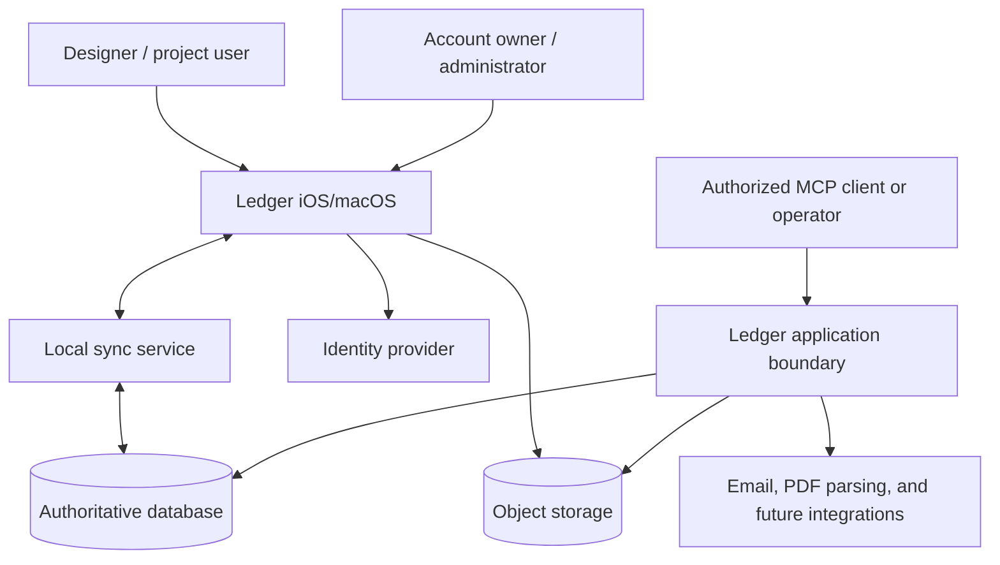

# System Context and Principles

Status: proposed architecture
Architecture version: 0.1
Last reviewed: 2026-08-31

## Purpose

Ledger is an offline-first accounting and inventory application for work that
often happens without Wi-Fi or cellular service. It is also a multi-surface
system: iOS and macOS clients, server-side business logic, media storage,
migration and administrative tooling, and an MCP interface all mutate or
interpret the same records.

The redesign must make offline operation dependable without allowing client
SDK behavior, retries, or concurrent edits to corrupt accounting history.

## Goals

- Preserve useful work through extended network loss and application restarts.
- Make domain code independent of Firebase, Supabase, PowerSync, and transport
  protocols.
- Establish one authoritative implementation for accounting invariants.
- Support iOS, macOS, MCP, migrations, and future clients through the same
  operation contracts.
- Prevent unauthorized structured data from being downloaded to a device.
- Preserve immutable paid history and reconstructible accounting provenance.
- Permit an isolated Supabase rebuild and rehearsed hard cutover without changing
  the running Firebase application during development.
- Make failures, queued operations, conflicts, and reconciliation drift visible.

## Non-Goals

- A generic persistence framework suitable for unrelated applications.
- Runtime hot-switching between production backends.
- Identical internal behavior from every backend SDK.
- Automatic semantic merging of every concurrent edit.
- Storing or syncing image/PDF bytes through the structured database sync path.
- Immediate revocation from a device that is physically offline; this is
  impossible without a connectivity or bounded-local-access policy.
- Maintaining two permanent systems of record.

## Stakeholders and External Systems



## Logical Containers

| Container | Responsibility | Must not own |
|---|---|---|
| SwiftUI presentation | Render read models, capture intent, display operation/sync state | Database paths, RLS logic, accounting transactions |
| Application layer | Orchestrate use cases, submit operations, choose queries, map errors | Vendor DTOs or SDK listeners |
| Domain layer | Business vocabulary, values, invariants, calculations, command validation | Networking, persistence, authentication SDKs |
| Local data plane | Durable working set, reactive queries, queued local changes | Final server authorization or cross-user truth |
| Operation authority | Validate identity/version/invariants and commit atomic mutations | UI decisions or client-only projections |
| Sync service | Replicate authorized server rows and upload durable changes | Business authorization for writes |
| Identity provider | Authenticate a principal and issue signed tokens | Account membership and Ledger financial permissions |
| Object storage | Store and serve attachment bytes | Canonical attachment relationships or accounting metadata |
| MCP/admin tooling | Invoke the same domain operations and authorized queries | Bypassing domain invariants for convenience |
| Migration system | Deterministically transform, journal, verify, and reconcile versions | Unreviewed production repair logic |

## Trust Boundaries

1. **The client device is not trusted for authorization.** It may perform local
   validation for UX, but server writes revalidate identity, membership,
   authority version, and domain preconditions.
2. **Signed authentication is not Ledger authorization.** A valid user token
   identifies a principal; account membership and financial access decide what
   that principal may do and see.
3. **Sync parameters are not authority.** A client-supplied account or project ID
   may narrow data only after a signed identity is proven entitled to it.
4. **PowerSync is replication infrastructure, not the system of record.**
   Postgres remains authoritative once the target backend is active.
5. **Privileged credentials are server-only.** Service-role, database-owner,
   migration, and Storage administration credentials never ship in the app.
6. **Offline access is cached access.** Revocation cannot reach a disconnected
   device. Local encryption, device authentication, disposition-aware logout
   clearing, and an approved offline access lease bound that risk.

## Architectural Principles

### 1. The domain speaks Ledger

Public application APIs use names such as `CollectInvoice`, `LinkItem`, and
`TransferItems`. Names such as `WriteBatch`, `DocumentReference`, `PostgREST`,
`RPC`, and `CRUDEntry` are adapter internals.

### 2. Offline is a normal state

Every core read uses the local working set. Every operation documents whether
it is offline-capable. Network-only operations are explicit exceptions and may
not masquerade as ordinary saves.

### 3. Local acceptance is not server commitment

The UI distinguishes a locally durable queued operation from a server-applied
operation. It never reports financial completion merely because a local write
was accepted.

### 4. Server authority protects invariants

Multi-entity accounting operations commit in one server transaction through a
trusted command handler. Direct client CRUD is limited to fields and entities
whose independent update cannot violate a cross-record invariant.

### 5. Commands and queries are separate

Queries return local read models optimized for screens and reports. Commands
express business intent and are validated against authoritative state. Neither
is forced into a lowest-common-denominator repository API.

### 6. Retries are expected

Every durable operation has a globally unique idempotency key. Repeating the
same operation returns the recorded result and does not duplicate money,
history, relationships, or media.

### 7. Evidence is append-oriented

Paid Invoice membership, collection allocation, Transfer pairs, correction
events, migration correlation, and operation results are immutable or reversed
through explicit compensating records. Mutable convenience projections can be
rebuilt from authoritative evidence.

### 8. Authorization fails closed

Missing membership, ambiguous financial metadata, stale authority versions,
and unknown command contracts deny access or reject the operation. UI hiding is
never the only confidentiality control.

### 9. Portability preserves capabilities

Backend-neutral ports define semantics, not a universal database API. The first
production implementation uses PowerSync and Supabase/Postgres; test adapters
prove the port contracts, and a future backend may replace the implementation
without changing product semantics.

### 10. Preserve outcomes, not accidental mechanics

The source implementation is evidence, not a template. Capability reviews
separate approved user outcomes and historical evidence from defects,
Firebase-shaped APIs, unstable pagination, broad listeners, duplicate writers,
suppressed failures, and other incidental behavior. Deliberate corrections and
quality improvements are recorded and tested so they cannot masquerade as
either accidental feature loss or mechanical parity.

### 11. Migration is a first-class subsystem

Schema evolution uses expand, migrate, switch, and contract. Every data-changing
migration is dry-run-first, resumable, idempotent, journaled, and reconciled.

## Dependency Rule

Dependencies point toward the domain:

```text
Presentation -> Application -> Domain
Infrastructure -> Application ports -> Domain
```

The following imports are prohibited outside target infrastructure/composition
code; Firebase SDK use is limited separately to migration/export tooling:

- Firebase SDK modules;
- Supabase client modules;
- PowerSync modules;
- raw SQL/database driver modules; and
- transport-specific response or error types.

Domain and application protocols may use only Ledger types and standard Swift
types. Backend timestamps, dynamic dictionaries, document snapshots, SQL rows,
and listener registrations are mapped at the adapter boundary.

## Quality Attributes

### Data integrity

- No accepted operation is lost across application termination or routine
  logout; explicit destructive local-account removal is the only documented
  user-authorized exception.
- No idempotent retry creates a second financial event.
- Cross-record accounting operations are all-or-nothing on the server.
- Paid history is never silently rewritten.
- Every migration and correction is traceable to source records and actor.

### Availability and responsiveness

- Cached project and inventory data opens without a network dependency.
- Local query updates and operation acceptance do not wait for a server
  round-trip.
- A stale or unavailable server changes sync state, not basic navigation.
- Attachments captured offline remain locally visible until upload completes.

### Security

- Tenant and financial access are enforced before download and at write time.
- Local structured data is encrypted at rest.
- Logout removes account databases, local media eligible for removal, and keys.
- Privileged operations emit immutable audit evidence.

### Evolvability

- New backends implement ports and contract tests rather than changing views.
- Additive schemas support old and new clients during a declared window.
- Feature activation and schema deployment are separate events.

### Operability

- Queue age, sync lag, command rejection, decode failure, and reconciliation
  drift are measurable.
- Environments and credentials fail closed against production confusion.
- Operators have documented freeze, resume, rollback, and reconciliation
  procedures.

## Provisional Performance Budgets

Exact service-level thresholds will be fixed after the vertical spike captures
real-device baselines. Until then, implementation must measure at least:

- local screen-query time by record count;
- local operation-acceptance latency;
- cold-sync time and downloaded bytes for the 1584 Design account;
- incremental sync latency after reconnect;
- local database size and query memory;
- attachment queue throughput and retry age; and
- server command latency at p50, p95, and p99.

No threshold may be declared met from simulator-only or empty-fixture tests.

## Architecture Review Gate

Before application implementation begins, reviewers must confirm:

- bounded contexts and command ownership;
- the identity/principal model;
- read/download and write authorization symmetry;
- complex-command offline projection strategy;
- schema choices affected by unresolved product decisions;
- environment isolation; and
- the adapter contract and fault-test plan.
