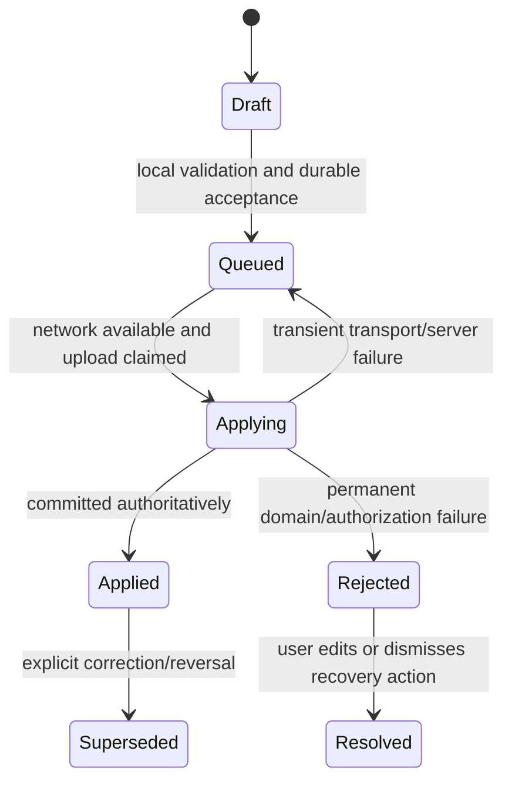

# Domain and Application Architecture

Status: proposed architecture
Architecture version: 0.1
Last reviewed: 2026-08-31

## Purpose

This document defines the code and behavior boundary between Ledger product
logic and infrastructure. It makes user operations portable across the
Supabase/PowerSync implementation, test stores, and future backends without
reducing important business operations to generic CRUD. Firebase is a migration
source, not a target application adapter.

Canonical product behavior remains in the accounting-redesign specs. This
document defines how that behavior is represented and executed.

## Layer Responsibilities

### Presentation

Presentation renders read models and submits user intent. It may:

- maintain transient form state;
- validate basic required fields for immediate feedback;
- display optimistic, queued, applied, rejected, and conflicted states; and
- navigate immediately after local acceptance where the use case permits.

Presentation must not:

- construct document paths or SQL;
- coordinate multi-record writes;
- infer server commitment from local acceptance;
- contain membership or financial authorization rules; or
- import a backend SDK.

### Application

The application layer contains use cases. It:

- converts form intent into typed commands;
- adds operation identity, actor, scope, contract version, and preconditions;
- invokes query, operation, attachment, identity, and sync ports;
- maps domain/application errors to presentation-safe states; and
- coordinates local optimistic behavior without owning server persistence
  mechanics.

### Domain

The domain layer contains:

- typed IDs and value objects;
- entity and aggregate behavior;
- accounting calculations and sign conventions;
- operation payloads and results;
- validation and invariant definitions;
- authority/version vocabulary; and
- pure projections that can be tested without storage.

The domain never reads the network, disk, clocks, UUID generators, or global
authentication state directly. Those capabilities are injected.

### Infrastructure

Infrastructure maps ports to PowerSync, Supabase, Storage, Auth, logging, and
external services. It owns SDK configuration, serialization, retries, SQL/RPC
calls, watch mechanics, and credential use. Firebase source export and
transformation live in migration tooling outside the target app.

## Bounded Contexts

The target app is divided by business ownership, not current Firestore
collections:

| Context | Owns | Does not own |
|---|---|---|
| Identity and Membership | Principal identity, account membership, role, financial access | Authentication provider internals |
| Client and Project | Client identity, project ownership, project lifecycle | Item accounting or Invoice settlement |
| Inventory | Business Inventory acquisition, placement, vendor return evidence | Project billing demand |
| Project Items | Physical Item identity, project placement, Space assignment, accounting-link state | Paid money events |
| Transactions | Scope-relative Purchase/Return and paired project Transfer evidence | Open business-paid billing demand |
| Invoicing | Item charges/credits, Expenses, Fees, live Invoice membership | Physical Item identity |
| Collection | Whole-Invoice payment, frozen allocation, paid boundary | Editing live source records after collection |
| Budget and Reporting | Derived segments, category allocation, reports, exports | Source-of-truth mutation |
| Attachments | Attachment identity, local capture, object lifecycle | Parent accounting semantics |
| Operations and Audit | Idempotency, result lifecycle, corrections, migration correlation | Product-specific UI |

Cross-context changes are commands with explicit owning handlers. A context may
read another context's projection but must not reach into its persistence tables
to implement an unowned side effect.

## Entities, Values, and Read Models

### Entities

Entities have stable identity across edits, devices, and backend migrations.
Examples include Account, Client, Project, Item, Invoice, Transaction, Expense,
Attachment, and Operation.

Entity IDs are generated before network access. An entity ID must never encode a
Firestore path, Postgres sequence, account name, or UI ordering.

### Value objects

Values should make invalid or ambiguous states harder to represent. Initial
examples include:

- `Money` as integer cents plus currency;
- `AccountID`, `ProjectID`, `ClientID`, `ItemID`, and `OperationID`;
- `AccountingAuthorityVersion`;
- `OperationContractVersion`;
- `PrincipalID` and `AuthSubject`;
- `AttachmentPath` rather than a permanent download URL;
- `ItemPlacement`; and
- typed Purchase, Return, and Transfer classifications.

Raw strings may remain at serialization boundaries, but application APIs should
prefer typed values.

### Read models

Read models are query-specific, immutable values optimized for screens and
reports. Examples:

- `ProjectWorkspaceSnapshot`;
- `InventoryWorkspaceSnapshot`;
- `InvoiceEditorSnapshot`;
- `ProjectBudgetSnapshot`;
- `UniversalSearchResult`;
- `ReportSnapshot` and `ExportSnapshot`; and
- `SyncHealthSnapshot`.

Read models may denormalize names, totals, status, and visibility-safe summaries.
They are not write DTOs and may be rebuilt at any time from authoritative local
tables.

Cross-domain query snapshots also carry `localDataVersion`, required-stream
readiness, accounting-authority version, visibility scope, deterministic sort/
cursor metadata, currency, and an as-of time. “No rows” and “the required
working set is not complete” are distinct states. Report/CSV/PDF renderers
consume these typed snapshots and never rederive accounting from mutable entity
arrays.

## Commands

A command records business intent. Its name must describe what the user or
trusted tool intends, not how a database will be updated.

Examples with unambiguous business intent:

- `CreateItem`;
- `LinkItemAsClientPaid`;
- `LinkItemAsBusinessPaid`;
- `RecordProjectPurchase`;
- `RecordInventoryPurchase`;
- `TransferItems`;
- `CreateInvoice`;
- `ReviseCreatedInvoice`;
- `MarkInvoiceSent`;
- `CancelInvoice`;
- `CollectInvoice`;
- `CreateExpense`;
- `UpdateOpenExpense`;
- `CancelOpenExpense`;
- `CreateFee`;
- `UpdateOpenFee`;
- `CancelOpenFee`;
- `CreateSpace`;
- `ReviseSpaceChecklists`;
- `AssignItemsToSpace`;
- `CreateSpaceReviewNote`;
- `ReviseSpaceReviewNote`;
- `PlaceInventoryItemInProject`;
- `RemoveUnpaidItemFromProject`;
- `ReturnPaidItemToInventoryAndCreateCredit`;
- `AcquireProjectItemIntoInventory`;
- `RestoreItemToSourceProject`;
- `RecordItemVendorDisposition`;
- `RecordInventoryVendorRefund`;
- `RecordProjectVendorRefund`;
- `SettleClientCreditAsCashRefund`;
- `ApplyClientCreditToInvoice`;
- `RepriceOpenItemCharge`;
- `CorrectPurchase`;
- `CorrectReturn`;
- `CorrectTransactionScope`;
- `ReverseTransfer`;
- `ArchiveSpace`; and
- `AcceptInvite`.

`ReturnItems` and `CorrectTransactionAndItems` are intentionally not commands.
They combine business events whose money, placement, and audit effects are not
interchangeable:

| Story | Command category | Transaction effect |
|---|---|---|
| Client pays a vendor directly | `RecordProjectPurchase` | Creates a project-scope Purchase for real Client money paid |
| 1584 buys inventory | `RecordInventoryPurchase` | Creates an inventory-scope Purchase and acquisition evidence for real 1584 money paid |
| Inventory Item is placed in a project | `PlaceInventoryItemInProject` | Creates current placement and an open Item charge/occurrence; no Project Transaction before collection |
| Unpaid physical Item leaves a project for Business Inventory | `RemoveUnpaidItemFromProject` | Removes open billing demand; does not create a Return because no money moved |
| Paid physical Item moves back to Business Inventory and the Client is owed value | `ReturnPaidItemToInventoryAndCreateCredit` | Creates an Item credit occurrence; does not create a Return until cash is actually refunded |
| Project-origin Item is genuinely acquired by 1584 | `AcquireProjectItemIntoInventory` | Records Inventory-side acquisition evidence and the applicable project demand/credit effect; never creates a project Sale type |
| Proven project-origin Item returns from Inventory | `RestoreItemToSourceProject` | Restores immutable source/basis and creates new open demand; does not claim cash moved |
| Item physically leaves for a vendor before money returns | `RecordItemVendorDisposition` | Records custody/status/provenance only and may later link to the actual refund Return |
| Vendor refunds 1584 for an inventory acquisition | `RecordInventoryVendorRefund` | Creates an inventory-scope Return for real 1584 money received |
| Vendor refunds a Client-paid project purchase | `RecordProjectVendorRefund` | Creates a project-scope Return for real Client money received |
| Ledger pays the Client an approved credit in cash | `SettleClientCreditAsCashRefund` | Creates the project Return at the actual cash-refund boundary |
| An approved credit offsets other Invoice demand | `ApplyClientCreditToInvoice` | Settles the credit without inventing a Return |
| Previously recorded evidence is wrong | `CorrectPurchase`, `CorrectReturn`, or `ReverseTransfer` | Appends an explicit correction/reversal; never masquerades as a physical return or refund |
| Scope was entered incorrectly and no immutable dependency exists | `CorrectTransactionScope` | Corrects proven data-entry evidence atomically; it does not represent physical or cash movement |

There is deliberately no public `MarkInvoicePaid`, selected-line collection,
generic Invoice-line mutation, or caller-authored source amount command. Payment
is recorded only by `CollectInvoice`; live membership changes use a lifecycle-
specific command that revalidates source eligibility and exclusivity.

Commands dependent on O-003, O-004, O-006, O-007, O-009, O-010, O-013, O-014,
O-015, O-028, O-029, O-032, O-033, or O-034
are taxonomy placeholders only until those product decisions and schemas close.
They must not be exposed as implementable operations merely because they are
named here.

Operations that only update an independent descriptive field may use a typed
simple mutation such as `RenameSpace` or `UpdateProjectNotes`. A caller still
must not send arbitrary field names and values across the application boundary.

## Operation Envelope

Every durable command is wrapped in a backend-neutral envelope:

```swift
struct OperationEnvelope<Payload: Codable & Sendable>: Codable, Sendable {
    let operationId: OperationID
    let contractVersion: OperationContractVersion
    let accountId: AccountID
    let actorPrincipalId: PrincipalID
    let clientCreatedAt: Date
    let payload: Payload
    let preconditions: [OperationPrecondition]
}
```

The production implementation may encode envelopes differently, but must
preserve these semantics:

| Field | Purpose |
|---|---|
| `operationId` | Global idempotency identity, generated once on the client |
| `contractVersion` | Reject or route payloads whose meaning is no longer supported |
| `accountId` | Tenant scope; server validates it against membership |
| `actorPrincipalId` | Audit intent; server derives and verifies the actor from authentication |
| `clientCreatedAt` | UX ordering/evidence, never sole authority for conflict or money |
| `payload` | Typed business intent |
| `preconditions` | Expected revision/placement/Invoice status/authority where needed |

The server adds received, started, and completed times. Client time is never a
substitute for server ordering.

## Operation Lifecycle



Required meanings:

- **queued** — safely stored on the device; not yet server committed;
- **applying** — in flight; retry is safe;
- **applied** — authoritative result committed and observed;
- **rejected** — server declined the operation without partially applying it;
- **superseded** — a later explicit correction changes its business effect; and
- **resolved** — the user/operator handled a rejection.

Transport failures do not become permanent domain rejections. Domain
rejections do not become infinite transport retries.

## Operation Receipt and Result

Local submission returns a receipt, not an assertion that the server committed:

```swift
struct OperationReceipt: Sendable {
    let operationId: OperationID
    let localState: LocalOperationState
}
```

Authoritative results are observable through an operation query:

```swift
enum OperationOutcome: Sendable {
    case applied(AppliedOperationResult)
    case rejected(DomainRejection)
    case superseded(CorrectionReference)
}
```

Errors visible to users use stable domain codes and recoverable context. Raw
Postgres, HTTP, Supabase, or PowerSync messages are diagnostic details only.

## Command Ownership and Atomicity

A command handler owns all authoritative mutations needed to preserve its
invariants. For example, `CollectInvoice` must atomically:

1. validate actor, membership, financial authority, command version, project
   authority, and Invoice status;
2. lock the Invoice and conditionally verify its expected revision and the
   ordered, canonical source-set hash;
3. re-resolve every source's current signed amount, category allocation,
   eligibility, Project, and active-Invoice exclusivity under the same database
   transaction;
4. validate one positive actual Client-payment amount and, until O-033 closes,
   require it to equal the authoritative positive Invoice total exactly;
5. freeze the exact collected contents, source revisions, signed amounts,
   category allocations, Invoice revision, and payment evidence;
6. create exactly one Project Purchase representing that actual collection;
7. link frozen allocations to that Purchase and Invoice;
8. move each stable source contribution from unpaid to paid without counting
   either the live Invoice link or the collection Purchase face amount as a
   second budget contribution;
9. remove sources from active Invoicing without deleting history;
10. update authoritative revisions/projections; and
11. store the operation result.

The client may compute a matching optimistic projection, but only the handler
crosses the paid boundary.

## Preconditions and Concurrency

Commands carry the minimum preconditions needed to detect meaningful stale
intent. Candidates include:

- entity revision equals expected revision;
- Item remains in the expected project;
- Item has no conflicting open operation;
- Invoice remains created/sent and unpaid;
- Invoice source-set hash and revision still match the reviewed intent;
- source and destination still share the same Client;
- accounting authority remains the expected version; and
- referenced source IDs still form the reviewed set.

The handler decides whether a stale condition is:

- safe to rebase automatically;
- an idempotent already-applied result;
- a user-visible conflict requiring a new decision; or
- an invalid/unauthorized operation.

Last-write-wins is acceptable only for explicitly classified descriptive
fields. It is not the default for money, placement with financial effect,
Invoice membership, paid state, or Transfer pairing.

## Domain Invariants

The architecture requires one named owner and executable test for every
invariant. Initial cross-cutting invariants include:

- every active project has one authoritative Client before Transfer is enabled;
- a Transfer never crosses Client IDs;
- a Transfer pair is created or corrected atomically;
- one physical Item has one identity across acquisition, placement, billing,
  and paid history;
- Invoice collection is whole-Invoice and idempotent;
- collected membership and allocation are immutable;
- each Item occurrence, Expense, Fee, approved adjustment, direct Client money
  allocation, or Transfer contribution has one stable budget-contribution
  identity and contributes once to exactly one applicable segment;
- collection moves value between segments without adding total spend;
- live Invoice links are grouping relationships, not additional budget value;
- the one collection Purchase is payment evidence and is not counted again on
  top of its frozen source allocations;
- paid history is corrected through explicit evidence, not mutation;
- account scope is immutable for domain entities; and
- attachment metadata cannot grant access to an unauthorized object path.

Open product decisions may add or refine invariants. They must not be guessed in
an adapter.

## Domain Events and Projections

Handlers may emit immutable domain events or evidence rows when downstream
projections need them. Events describe completed facts, such as:

- `InvoiceCollected`;
- `InvoiceRevisedAndSent` once O-034 defines its exact delivery semantics;
- `ItemsTransferred`;
- `PaidItemCreditCreated`;
- `SpaceArchived`; and
- `OperationRejected`.

Events are not a requirement to implement full event sourcing. Canonical entity
tables may remain state-oriented. Audit-critical facts must, however, be
append-only and sufficient to reconstruct how a paid or transferred result was
created.

Derived budgets, search indexes, status summaries, and reporting views must be
rebuildable. A derived projection is never the sole evidence of a money event.

## Clocks, IDs, and Determinism

Domain code receives:

```swift
protocol Clock: Sendable { func now() -> Date }
protocol IDGenerator: Sendable { func next() -> String }
```

Tests use fixed clocks and deterministic IDs. Migration code must generate
stable IDs from recorded mapping artifacts or preserve source IDs; rerunning a
migration cannot create new identities for the same source.

## Application Error Taxonomy

| Category | Example | Retry behavior |
|---|---|---|
| Local validation | Missing required Client-paid Purchase | Fix before queueing |
| Authorization | Principal lost project access | Do not retry unchanged |
| Precondition conflict | Item moved on another device | Refresh and ask/rebase |
| Domain rejection | Invoice already collected differently | Show authoritative result |
| Contract incompatibility | Client operation version retired | Require supported update |
| Transient infrastructure | Network unavailable, 503 | Retain and retry |
| Corruption/bug | Unknown payload, invariant violation | Quarantine, alert, preserve evidence |

## Composition and Feature Activation

The composition root chooses one coherent Supabase/PowerSync environment at app
launch. Production does not expose a user-facing backend toggle and the target
build contains no Firestore data adapter. Before cutover the released Firebase
app remains separate; after cutover the Supabase target owns the scope.

Feature flags may activate a use case only when its schema, reader, writer,
authorization, migration, and observability gates are all ready. A flag must not
change the meaning of already-queued commands without contract-version routing.
