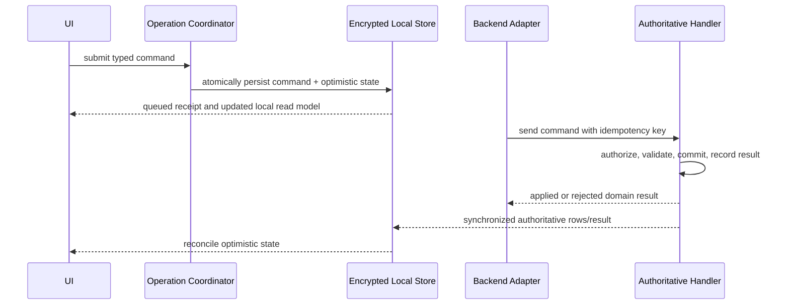

# Data, Sync, and Offline Architecture

Status: proposed architecture
Architecture version: 0.1
Last reviewed: 2026-08-31

## Purpose

This document defines what Ledger guarantees offline, which system owns each
kind of data, how data reaches devices, and how queued changes reconcile with
authoritative server state.

## Data Authority

| Data | Working copy | Authority | Notes |
|---|---|---|---|
| Structured domain records | Encrypted local SQLite | Supabase Postgres after cutover | Firebase remains the production authority until the hard-cutover window; snapshot imports do not change that authority |
| Pending operations | Durable local queue/outbox | Local until accepted; server result after processing | Operation ID joins both sides |
| Operation outcomes/audit | Local synchronized copy | Postgres | Append-oriented |
| Attachment bytes awaiting upload | App-managed local files | Local until upload verifies | Must survive restart |
| Uploaded attachment bytes | Local cache | Supabase Storage | Canonical path stored in structured data |
| Authentication session | Keychain/provider SDK | Identity provider | Does not grant account membership alone |
| Membership and financial access | Local synchronized copy | Postgres | Download and write authorization use server facts |
| Budgets/search/report projections | Local derived/query state | Rebuildable from canonical server facts | Never sole financial evidence |
| Migration correlation/manifests | Optional local copy | Migration/audit schema and signed artifacts | Immutable run identity |

PowerSync holds replication state and an upload queue. It is not an accounting
authority. Local state is optimistic and converges to the authorized server
state when uploads and downloads complete.

## Offline Contract

Core offline-capable behavior includes:

- navigating previously synchronized accounts, projects, inventory, Items,
  Spaces, Transactions, Invoicing, and reports;
- local search and calculation from the synchronized working set;
- creating and editing ordinary records;
- submitting complex operations as durable queued intent;
- capturing attachments and displaying their local bytes;
- surviving application termination, device restart, and network changes; and
- showing queue and conflict state without blocking unrelated work.

Explicit network-only operations include:

- first authentication on a device;
- authentication-provider account recovery;
- external PDF/OCR/API processing that is not available locally;
- downloading media that has never been cached; and
- immediate server-only validation whose product flow explicitly requires an
  online response.

An operation may be offline-capable even when its authoritative effect cannot
occur offline. The UI must show it as queued until the server result arrives.

## Local Database Design

The local database contains:

1. PowerSync-managed synchronized tables/views;
2. approved local-only tables for form drafts, pending-operation UI state,
   media queue metadata, and diagnostics; and
3. indexes required by actual screen queries.

It must not become an unversioned second domain schema. Every local-only table
has an owner, retention policy, encryption classification, and reset behavior.

All synced tables use stable text IDs at the client boundary. Booleans,
timestamps, JSON, and enums are mapped deliberately into supported SQLite
representations. Money remains integer cents.

## Local Database Lifecycle

- Use a small encrypted bootstrap database/key namespace per signed-in Ledger
  Principal and environment for Account discovery/selection evidence. After
  explicit selection and successful later workspace activation/authorization-
  lease enforcement, open a separate encrypted Account-workspace database/key
  namespace for the selected Principal, environment and Account. At most one
  Account-workspace database is open at a time; switching closes the old
  workspace before opening the new one.
- Never open a production database with staging credentials or vice versa.
- A normal logout/account-removal request first applies the pending-work
  disposition policy below. The database and key are removed only after that
  policy permits destructive cleanup.
- On account switching, stop old stream subscriptions before exposing the new
  account's read models.
- On schema upgrade, maintain backward-compatible synchronized representations
  through the supported-client window.
- A corrupted database is quarantined for diagnostics before a clean resync;
  pending operations and local-only media must be exported/recovered first.

## Synchronization Streams

The target stream families are:

### Identity bootstrap

Small, automatically subscribed data needed to discover authorized accounts and
establish principal/account context:

- principal profile;
- account memberships and safe account display metadata;
- authority/configuration state safe for that principal; and
- recent operation outcomes for that principal.

### Account catalog

Shared account-level reference data:

- Clients and projects;
- budget categories, Space templates, and vendor defaults;
- authorized account members where the user's role permits them; and
- safe cross-project lookup metadata.

### Inventory

Subscribed while an account's Business Inventory is active or required by an
authorized background query:

- inventory Items and acquisitions;
- inventory Purchase/Return records;
- inventory Spaces and relevant attachment metadata;
- slim Item occurrence/lineage evidence for every inventory Item, including the
  IDs, event kind, source/destination scope, source record, amount basis, and
  immutable timestamps needed to explain inventory↔project sale, return,
  resale, and Transfer cycles; and
- open operations affecting inventory.

Large source documents and full historical detail may use a separately
authorized `inventory_item_history(item_id)` stream, but the base Inventory
stream must contain enough visibility-safe provenance to explain each Item's
current placement and accounting chain offline. An inventory read model exposes
history readiness/completeness; it must not display a partial chain as complete.
Financial permissions apply before this evidence is downloaded, including
amounts and existence-sensitive metadata.

### Project workspace

An on-demand subscription narrowed by `project_id` and authorized through
account membership:

- project details and Spaces;
- project Items and placement;
- project Purchase/Return/Transfer evidence;
- open Item occurrences, Expenses, Fees, and Invoices;
- project notes/preferences visible to the principal; and
- budget/reporting source rows or safe local projections.
- local search index/projection rows and report/export inputs authorized for the
  principal; each projection exposes the exact stream/version readiness it
  requires.

### Historical detail

Large immutable history may use lower-priority or on-demand streams if the
vertical spike proves that syncing it eagerly harms startup. A project must
still expose enough local history to explain totals and recent corrections
offline.

## Stream Authorization Rule

Every parameterized stream combines client intent with signed authorization:

```text
requested project ID
AND project belongs to an account
AND signed principal is an active account member
AND row-level financial visibility permits download
```

A subscription parameter can only narrow the authorized result. It can never
substitute for the membership join. Stream queries and RLS policies have paired
security tests and one documented source of authorization facts.

## Sync Priorities

Suggested priority order, subject to measurement:

1. membership, authority, and operation outcomes;
2. account/project shell required for navigation;
3. current project and active inventory data;
4. open Invoicing and pending operations;
5. recent history and report evidence; and
6. older immutable history.

The application must not infer “fully synchronized” from connection state.
Readiness is tracked for the specific subscriptions a screen requires.
Search returns only the synchronized authorized working set and labels whether
each requested scope is complete. Report/export preparation fails visibly or
requires an explicit partial diagnostic mode when required inputs are not ready;
ordinary client-facing artifacts never imply completeness from connection state
or an empty local query.

## Write Classes

### Independent field operations

A typed edit may update a row directly through the adapter when all of these
are true:

- it affects one aggregate;
- it cannot cross a paid/financial boundary;
- no second row must change atomically;
- its conflict policy is documented; and
- server authorization and validation still apply.

Examples may include notes, display ordering, and some preference updates.

### Domain commands

All multi-row or invariant-sensitive changes use a durable command envelope and
one authoritative handler. Examples include Transfer, Invoice collection,
Link, specific physical-movement, vendor-refund, credit-settlement, explicit
correction/reversal, archive-with-detach, membership acceptance, and bulk
relationship changes. There is no generic Item “return” command because
physical movement, cash refund, pending credit, and correction have different
authoritative effects.

The adapter must not upload the command's constituent optimistic row mutations
as unrelated authoritative writes.

## Complex Offline Optimism

The exact PowerSync implementation remains a gated spike, but conformance
requires this sequence:



Potential implementations include a pending-operation overlay, tagged
optimistic row mutations, or a hybrid. The selection must demonstrate rollback,
cross-screen consistency, and queue isolation for permanent failures.

## Conflict Policy

Conflicts are classified rather than handled by one global last-write-wins rule:

| Class | Examples | Policy |
|---|---|---|
| Descriptive scalar | Notes, optional label | Documented LWW or field merge |
| Set membership | Tags, selected attachments | Set-aware merge with stable IDs |
| Ordered collection | Checklist/order | Revisioned operation or explicit reorder |
| Placement | Item project/Space | Preconditions; reject/rebase stale intent |
| Financial source | Amount/category/source | Server validation and revision |
| Invoice membership/state | Live membership, collected boundary | Transactional command; paid state immutable |
| Transfer pair | Source/destination records | One command; never independent merge |
| Deletion | Referenced domain entity | Soft-delete/tombstone plus policy |

A server rejection is written as an operation outcome, acknowledged to the sync
queue, and surfaced for recovery. It must not block later unrelated uploads.

## Timestamps and Ordering

Every record that needs audit/order distinguishes:

- `client_created_at` — device-reported intent time;
- `server_received_at` — first authoritative receipt;
- `created_at` and `updated_at` — server-maintained persistence times;
- `effective_at` — business date when product behavior requires it; and
- `revision` — monotonic optimistic-concurrency value where relevant.

Client clocks never decide idempotency, authorization, paid ordering, or which
conflicting financial mutation wins.

## Deletion and Retention

- Referenced accounting entities are soft-deleted or archived.
- Paid evidence, operation outcomes, Transfer pairs, corrections, and migration
  correlation are retained according to an approved audit policy.
- Tombstones remain synchronized long enough to prevent an offline device from
  resurrecting deleted state.
- Physical deletion is a background retention operation, never the immediate
  response to a user action involving financial evidence.
- Attachment byte deletion occurs only after authoritative reference checks and
  the rollback/retention window.

## Attachments

The structured attachment record contains a stable attachment ID, account and
parent scope, canonical bucket/path, content type, byte size/checksum when known,
derivative paths, local/upload state, and audit timestamps. It does not store a
long-lived bearer URL as canonical identity.

Lifecycle:

1. save bytes and queue metadata atomically enough that neither is orphaned;
2. show the local file immediately;
3. upload to a deterministic account-scoped path;
4. verify object existence, size, and checksum where supported;
5. create/update authoritative attachment metadata idempotently;
6. generate short-lived access URLs when rendering private media; and
7. clean local source bytes only after upload verification and retention rules.

Large or unstable uploads should use resumable transfer. Structured sync carries
metadata only.

## Logout and Local Pending Work

Local durability means an accepted operation is not silently destroyed by a
routine logout. Before sign-out or local account removal, Ledger counts:

- queued/applying operations without an authoritative result;
- rejected operations whose recovery evidence has not been resolved; and
- captured attachment bytes whose upload has not been verified.

If all counts are zero, logout stops synchronization, removes the account
database and encryption key, clears signed URLs/caches, signs out the provider,
and verifies cleanup.

If any count is nonzero, normal logout is blocked behind a disposition screen
that offers:

1. **Cancel and remain signed in**;
2. **Sync then log out**, available when online and completed only after every
   item reaches an authoritative or explicitly resolved state; or
3. **Remove from this device and discard local pending work**, which names the
   exact operation/media counts and requires explicit destructive confirmation.

The third path is the only permitted exception to “no lost locally accepted
operation.” It deletes the queue, unuploaded bytes, database, and key; it cannot
claim those operations reached the server. Closing the dialog, provider token
expiry, app termination, or cleanup failure never implies consent. Interrupted
cleanup resumes fail-closed before that principal's data can be reopened.

Administrative revocation is different from voluntary logout: on reconnect,
unauthorized uploads become durable rejected outcomes, and local evidence stays
available only as allowed by the approved offline-access lease and recovery
policy before final secure deletion.

## Auth and Offline Access

A previously authenticated principal may use synchronized local data according
to the approved offline-access lease and device-unlock policy. Local ability to
open data does not create a valid online token.

When connectivity returns:

- refresh authentication before uploading;
- re-evaluate membership and stream authorization;
- remove rows no longer authorized;
- process pending commands only if server authorization still permits them; and
- report rejections without discarding local evidence prematurely.

Immediate remote revocation cannot be promised while the device is offline.

## Sync Health Model

Presentation consumes a backend-neutral health snapshot containing at least:

- connectivity state;
- authentication refresh state;
- active subscription readiness;
- last successful download/checkpoint time;
- pending operation count and oldest age;
- pending attachment count and oldest age;
- transient upload/download error;
- rejected operation count; and
- whether a migration/client update blocks writes.

The UI communicates actionable state without blocking unrelated offline work.
“Online” and “synced” are separate concepts.

## Required Offline Fault Cases

Every core operation is tested for:

- process termination immediately after local acceptance;
- restart while still offline;
- token expiry before reconnect;
- membership revocation while disconnected;
- repeated delivery of the same command;
- concurrent conflicting device operation;
- network loss during server application;
- server commit followed by lost response;
- permanent domain rejection;
- malformed/retired command contract;
- database corruption and recovery; and
- attachment upload interruption and duplicate completion.
