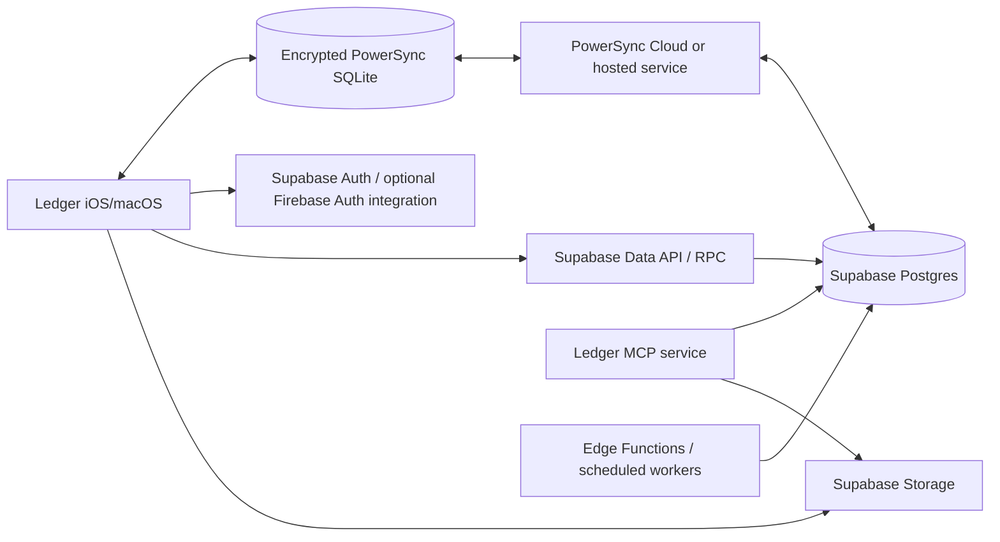

# Supabase and PowerSync Reference Architecture

Status: proposed target; vertical spike required
Architecture version: 0.1
Last reviewed: 2026-08-31

## Purpose

This document describes the initial target implementation of the backend-neutral
ports. It is specific to Supabase and PowerSync and may be replaced without
changing domain/application contracts.

## Deployment Topology



The app does not query Postgres for ordinary screen reads. It queries the local
database. Supabase API calls are used by the PowerSync upload connector and
explicit network-only integrations.

## Postgres Schema Boundaries

Recommended logical schemas:

| Schema | Purpose | Data API exposure |
|---|---|---|
| `ledger` | Canonical domain tables | Not directly exposed |
| `api` | Explicit RPC functions and security-invoker views | Exposed deliberately |
| `private` | RLS helpers and privileged internal functions | Never exposed |
| `audit` | Operation, correction, migration, and reconciliation evidence | Server/operator access only except safe result views |
| `storage` | Supabase-managed object metadata | Managed by Supabase; use policies, do not customize schema objects |

This separation is preferred over placing every table in an automatically
exposed `public` schema. The exact configured exposed schemas and grants must be
verified in each environment. New Supabase projects may not auto-expose new
tables through the Data API.

If a security-invoker `api` function needs table privileges, grant only the
necessary operations to `authenticated` and rely on RLS for row scope. Use
`SECURITY DEFINER` only for a reviewed need that cannot be served safely by
invoker rights; place it in a non-exposed schema, set an empty/safe search path,
revoke default `PUBLIC` execution, and perform explicit identity checks.

## Conceptual Canonical Tables

This is a relationship inventory, not final DDL. Open product decisions still
control exact columns and cardinalities.

### Identity and tenancy

- `principals`
- `auth_identities` (`issuer`, `subject`, `principal_id`)
- `accounts`
- `account_members`
- `member_financial_permissions`
- `account_invites` with lifecycle, proposed access, expiry and a one-way token
  digest; raw invite secrets are never stored in a Sync Stream or client row

### Client and project

- `clients`
- `projects`
- `spaces`
- `project_preferences` keyed to the owning Principal and Project, with
  revisioned stable preference values rather than caller-selected user paths
- `project_notes` with immutable creator/creation evidence, mutable revision,
  deterministic `(created_at, id)` ordering and authorized tombstone state
- `space_review_notes`

### Inventory and Items

- `items`
- `item_acquisitions`
- `item_placements` or authoritative placement columns/history
- `item_occurrences` for charge/credit provenance once approved
- `non_item_receipt_lines`
- `attachments` for stable byte/object identity and verified metadata
- `attachment_references` for ordered, typed parent relationships, primary/pin
  state and reference-level audit; exact retention/removal fields remain O-023
- rebuildable attachment derivative metadata where the chosen derivative policy
  requires persisted status; derivative objects never become canonical identity

### Accounting and Invoicing

- `transactions`
- `transaction_items`
- Transaction capture/review state if O-032 approves a durable nonfinancial
  draft rather than keeping it solely in the operation/form store
- `transfers` and/or paired Transfer entries
- typed vendor cancellation/account-credit evidence if O-028 approves it; this
  is not a fourth Transaction type
- `expenses`
- `fees` / fee installments
- `invoices`
- `invoice_lines`
- `invoice_source_links` for live membership by stable typed source ID and
  expected revision; these links do not duplicate source amounts as authority
- immutable collected line/allocation/payment-snapshot tables recording the
  exact source revision, signed amount, category allocation, Invoice revision,
  collection Purchase, and rendered/delivery evidence required by O-034

### Operations and evidence

- `operations`
- `operation_results`
- `correction_events`
- lineage/evidence edges that remain necessary after occurrence design
- migration source correlation and run journals

### Reference and projections

- budget categories and Project-category enablement/allocation rows that retain
  the difference among absent, enabled-without-allocation and explicit zero
- ordered vendor-suggestion entries with stable identity; selection still writes
  a free-text source snapshot and does not create canonical Vendor identity
- revisioned/archiveable Space templates and ordered checklist templates;
  applying/capturing a template resets checked state
- rebuildable budget/search/report projections where measurement justifies
  stored projections

## Table Conventions

- Client-visible IDs are stable text values generated before connectivity.
- Every tenant-owned row carries immutable `account_id`.
- Foreign keys represent actual relationships rather than copied array IDs.
- Every foreign-key/filter/RLS join used at scale has a reviewed index.
- Monetary fields are integer cents with an explicit currency policy.
- Mutable conflict-sensitive rows carry a monotonic revision.
- Soft deletion uses explicit archive/delete timestamps and actor evidence.
- Server timestamps use database defaults/triggers or trusted handlers.
- JSON is reserved for truly variable snapshots or versioned operation payloads,
  not used to avoid modeling core relationships.
- Paid snapshots and correction evidence are append-only.
- Created/sent Invoice source links are grouping relationships; current source
  values remain authoritative until collection. A database uniqueness
  constraint/claim prevents one source from belonging to competing active
  Invoices.
- Every accounting source/allocation has a stable contribution identity. The
  budget projection changes that identity from unpaid to paid at collection;
  neither the live Invoice link nor collection Purchase face amount creates a
  second contribution.
- Canonical Transaction type is constrained to Purchase, Return, or Transfer;
  draft/review and non-cash vendor-adjustment state do not widen that enum.
- Current placement and historical Transaction membership are separate
  relationships. Moving an Item never erases its earlier paid/acquisition line.

## PowerSync Source Configuration

PowerSync connects to Postgres using a dedicated replication/service identity
with only required source access. Configure:

- logical replication/publication for approved tables;
- one isolated PowerSync instance per environment;
- matching region selection where possible;
- signed client authentication verification;
- version-controlled Sync Stream configuration;
- alerts for replication lag, upload failures, hosted data, and sync volume; and
- explicit schema-change/reprocessing procedures.

PowerSync internal hosted data can exceed source row size because it stores
current data plus operation history and parameter lookups. Capacity decisions
use measured service metrics, not only Postgres database size.

## Sync Streams

Sync Streams are version-controlled infrastructure. Representative shape:

```yaml
config:
  edition: 3

streams:
  account_catalog:
    auto_subscribe: true
    queries:
      - >-
        SELECT a.* FROM ledger.accounts a
        JOIN ledger.account_members m ON m.account_id = a.id
        JOIN ledger.auth_identities i ON i.principal_id = m.principal_id
        WHERE i.subject = auth.user_id()
          AND i.issuer = auth.parameter('iss')
          AND m.revoked_at IS NULL

  project_workspace:
    queries:
      - >-
        SELECT p.* FROM ledger.projects p
        WHERE p.id = subscription.parameter('project_id')
          AND p.account_id IN (...authorized account membership query...)
      - >-
        SELECT item.* FROM ledger.items item
        WHERE item.project_id = subscription.parameter('project_id')
          AND item.account_id IN (...authorized account membership query...)
```

The final syntax must be validated against the deployed PowerSync version.
Security properties, not this illustrative YAML, are normative:

- membership derives from the signed issuer and subject;
- the bootstrap Account catalog includes only authorized Account summaries plus
  the caller's membership/financial-capability snapshot needed to open a
  workspace; it does not download the whole member directory;
- a separate capability-gated Account-administration stream may include
  visibility-safe member and pending-invite summaries for authorized admins,
  but never Auth subjects, raw invite secrets or token digests;
- the requested project narrows an authorized account;
- financial permissions filter restricted rows before download;
- inventory subscriptions include visibility-safe occurrence/lineage rows
  sufficient to explain current placement and sale/return/resale provenance;
- any on-demand Item-history stream reports readiness so partial history cannot
  be presented as complete;
- project workspace subscriptions include authorized live Invoice source links,
  Expense/Fee sources, immutable paid allocations, and contribution projection
  rows needed to render `ProjectBudgetSnapshot` offline; financial restrictions
  are applied before those rows, counts, or amounts are downloaded;
- stream changes are reviewed with paired RLS tests; and
- incompatible client schemas remain supported through connection/contract
  versioning during the release window.

## Local Swift Integration

The Swift adapter:

- opens one encrypted PowerSync database for the current principal/environment;
- defines the generated/hand-reviewed client schema and indexes;
- connects with an authenticated backend connector;
- subscribes to bootstrap streams after identity is available;
- starts/stops inventory and project streams based on application context;
- maps watch queries into application read models; and
- maps upload transactions into direct safe mutations or domain commands.

Pin the PowerSync and Supabase Swift package versions and commit resolved package
state. Dependency upgrades require adapter contract, offline, security, and
schema compatibility tests.

## Upload Connector

The connector processes one durable unit at a time:

1. acquire the next PowerSync CRUD transaction/batch;
2. classify its contract as an approved simple mutation or operation envelope;
3. refresh/obtain the identity token;
4. invoke the matching `api` RPC or safe table mutation;
5. wait for the underlying Postgres transaction to finish;
6. map an applied or permanent rejected result into durable server state;
7. complete the PowerSync unit; or
8. throw only for transient infrastructure failures that should retry.

A `4xx`-style permanent validation response must not remain as an exception that
blocks the entire upload queue. It becomes a successful transport response with
a rejected domain outcome.

## Command Functions

Each authoritative command function must:

- authenticate the current signed identity;
- resolve it to an active Ledger principal;
- authorize membership and financial capability;
- validate operation and accounting authority versions;
- claim or read the idempotency key inside the transaction;
- lock/conditionally update relevant rows in a deterministic order;
- enforce constraints and domain preconditions;
- commit all canonical mutations and result evidence atomically;
- return the existing result for an identical retry; and
- reject reuse of an operation ID with a different payload hash.

Prefer narrowly named functions such as `api.collect_invoice` and
`api.transfer_items` over one untyped JSON mutation endpoint. A shared internal
dispatcher is acceptable only when its versioning, validation, authorization,
and observability remain explicit.

## RLS and Grants

- Enable RLS on every exposed or tenant-bearing table.
- Explicitly grant only required operations; RLS and grants solve different
  problems.
- Every update policy has a matching select policy plus `USING` and `WITH CHECK`.
- Use `TO authenticated` together with a tenant/permission predicate; the role
  alone is not authorization.
- Do not use user-editable metadata for authorization.
- Create safe views with `security_invoker = true` or keep them unexposed.
- Put privileged lookup helpers in `private`, pin their search path, revoke
  default execution, and test them under each role.
- Run Supabase security/performance advisors and the project RLS test suite for
  every migration.

## Authentication Transition

### Temporary Firebase Auth option

Use this phase only if proposed decision A-007 closes in favor of temporary
Firebase Auth integration:

- Firebase Auth continues issuing the app token.
- Existing users receive the required authenticated role claim.
- Supabase Third-Party Auth validates the registered Firebase project.
- PowerSync validates Firebase RS256 tokens and derives the signed subject.
- `auth_identities` maps Firebase issuer/subject to a Ledger principal.

### Supabase Auth phase

- Import or roll users into Supabase Auth using a rehearsed strategy.
- Add a Supabase issuer/subject identity mapped to the existing principal.
- Update the app identity adapter and PowerSync auth configuration.
- Keep domain `principal_id`, memberships, ownership, and audit references
  unchanged.
- Remove Firebase identity only after session adoption and rollback gates close.

## Storage

Use private account-scoped buckets or paths. Canonical attachment identity is a
bucket/path pair plus attachment ID, never a long-lived public URL.

Storage policies must validate active account membership and allowed path scope.
Upsert policies require select, insert, and update permissions. Deletion is
normally performed by a trusted retention command after reference checks.

Use resumable upload for large files or unstable networks. The existing local
media queue becomes the adapter-independent durable source queue and retains
bytes until verified completion.

## Edge Functions and Background Work

Use Postgres transactions/functions for database-local invariants. Use Edge
Functions or workers for:

- external APIs;
- email/invite delivery;
- document parsing and AI/OCR work;
- webhook handling;
- media processing not performed on-device; and
- scheduled reconciliation/retention jobs.

Background handlers are idempotent and do not acknowledge an operation as
authoritatively applied before its required database state exists. Core
PowerSync write handlers are synchronous with their Postgres mutation.

## MCP and Administrative Tooling

The MCP server uses the same typed operation contracts and version checks as the
app. It may use a privileged server credential only when:

- the tool authenticates and authorizes the human/agent actor;
- the command explicitly records actor and acting service;
- domain handlers enforce the same invariants;
- reads apply financial visibility; and
- the privileged credential never appears in client-visible configuration or
  logs.

Administrative repair tools are separate, dry-run-first commands with narrower
scope and stronger audit requirements. They are not ordinary MCP mutations.

## Supabase Change-Sensitivity Notes

Implementation must verify current documentation and changelog before every
dependency or platform change. Current architecture-relevant changes include:

- new tables may not be automatically exposed to the Data API;
- the Supabase-managed `realtime` schema is locked against modification;
- custom objects do not belong in managed `auth`, `storage`, or `realtime`
  schemas; and
- client retry behavior can change independently of PowerSync's durable upload
  semantics.

These reinforce the explicit `api` schema, explicit grants, infrastructure
versioning, and adapter contract tests in this architecture.

## Vertical Spike Exit Criteria

The executable phases, synthetic scale, mandatory test IDs, physical matrix,
artifact format and no-go rule are defined in the
[isolated vertical-spike protocol](../../plans/ledger-accounting-redesign/vertical-spike-protocol.md).
The criteria below are the architecture summary and do not substitute for that
evidence.

The target is approved only after a real Swift build demonstrates:

- authentication with the chosen launch identity strategy to both Supabase and
  PowerSync, including Firebase JWT validation only if A-007 selects it;
- encrypted local database lifecycle;
- account-authorized project Sync Streams;
- offline-complete inventory provenance for repeated sale/return/resale cycles;
- local read/watch performance with production-scale fixture counts;
- offline command persistence across process termination;
- one complex transactional command with idempotent retry;
- permanent rejection without queue blockage;
- membership/financial access removal on reconnect;
- interrupted/resumed attachment upload;
- schema evolution with an older client fixture; and
- measured hosted data, synced bytes, cold-sync time, and local database size.

## Platform Reference Set

Implementation reviews must re-check these current primary references rather
than relying on this document alone:

- [Supabase changelog](https://supabase.com/changelog.md)
- [Supabase Row Level Security](https://supabase.com/docs/guides/database/postgres/row-level-security)
- [Supabase Firebase Auth integration](https://supabase.com/docs/guides/auth/third-party/firebase-auth)
- [Supabase Firebase Auth migration](https://supabase.com/docs/guides/platform/migrating-to-supabase/firebase-auth)
- [Supabase resumable Storage uploads](https://supabase.com/docs/guides/storage/uploads/resumable-uploads)
- [PowerSync Swift SDK](https://docs.powersync.com/client-sdks/reference/swift)
- [PowerSync with Supabase](https://docs.powersync.com/integrations/supabase/guide)
- [PowerSync RLS and Sync Streams](https://docs.powersync.com/integrations/supabase/rls-and-sync-streams)
- [PowerSync client-side backend integration](https://docs.powersync.com/configuration/app-backend/client-side-integration)
- [PowerSync write validation handling](https://docs.powersync.com/handling-writes/handling-write-validation-errors)
- [PowerSync schema changes](https://docs.powersync.com/maintenance-ops/implementing-schema-changes)
- [PowerSync data encryption](https://docs.powersync.com/client-sdks/advanced/data-encryption)
- [PowerSync performance and limits](https://docs.powersync.com/resources/performance-and-limits)
