# Migration, Release, and Cutover

Status: proposed architecture; no production migration authorized
Architecture version: 0.1
Last reviewed: 2026-08-31

## Purpose

This document coordinates three changes that must not be confused:

1. building the redesigned app behind backend-neutral ports with a
   Supabase/PowerSync implementation;
2. implementing the redesigned accounting model; and
3. moving authority from Firebase to Supabase/PowerSync.

They share one program, but each has independent verification and rollback
points.

## Migration Principles

- Do not port the current Firestore schema literally and redesign it again.
- Design the approved target model in Postgres and transform source data into it.
- Do not wrap Firebase behind the new ports or implement target behavior there.
- Leave the released Firebase application untouched except for separately
  approved operational cutover controls.
- Avoid general client dual writing.
- Keep one declared authority per account/scope/version.
- Make production migration the replay of a rehearsed artifact, not live
  discovery.
- Preserve source IDs, mappings, and financial evidence through the rollback
  window.
- Defer destructive cleanup until target stability and client adoption are
  proven.

## Environment Topology

| Environment | Structured backend | Sync | Auth | Storage | Purpose |
|---|---|---|---|---|---|
| Source fixture harness | Versioned sanitized Firebase exports; emulator only if the exporter itself requires it | None | None | Fixture metadata/media subset | Export/transform tests only; never target app behavior |
| Local target | Local Supabase/Postgres | Local PowerSync service/test client where supported | Test issuer/Supabase local Auth | Local Supabase Storage | Schema, RLS, functions, adapter development |
| Cloud staging | Dedicated Supabase project | Dedicated PowerSync instance | Staging Supabase identities or separately approved Firebase Auth integration | Staging bucket | Real-network, migration, sync, Auth, and release rehearsal |
| Production source | Existing production Firebase | Existing Firestore sync | Production Firebase Auth | Production Firebase Storage | v1 authority until cutover; read-only audit/export during rehearsal |
| Production target | Dedicated production Supabase project | Production PowerSync instance | Supabase Auth or separately approved Firebase Auth integration | Production Supabase Storage | v2 authority after cutover |

There is no Firebase application staging lane and no Firebase target adapter.
Source fixture/export tests are operational migration tests only. The primary
rehearsal environment is Supabase + PowerSync staging, and no staging credential
may write production.

## Program Phases

### Phase 0 — Baseline and inventory

- Establish exact production app, Firebase Functions/rules/indexes, MCP, and
  data versions from a clean worktree.
- Inventory production collections, field variants, enums, counts, attachment
  metadata, Auth providers, rules, triggers, and pending compatibility paths.
- Record current data volume using a fresh authorized export.
- Freeze the canonical product decision and architecture registers for the
  first implementation increment.

Exit: reproducible source baseline and no unexplained deployed component.

### Phase 1 — Backend-neutral target application foundation

- Introduce domain values, read ports, operation ports, identity, attachments,
  sync health, and environment configuration in the redesigned target modules.
- Implement deterministic in-memory/failure adapters for use-case tests.
- Define the Supabase/PowerSync composition root and prohibit Firestore data
  imports in the target application.
- Keep the released Firebase app and backend behavior unchanged.

Exit: target domain/application contracts are executable in tests, the new app
contains no Firebase data adapter, and production is untouched.

### Phase 2 — Target foundation

- Provision local and cloud staging Supabase/PowerSync environments.
- Implement identity/principal mapping, account membership, RLS, and bootstrap
  Sync Streams.
- Implement encrypted local database lifecycle and sync health.
- Build the first vertical slice and close architecture spike decisions.
- Establish schema migration, advisors, type generation, and deployment CI.

Exit: target adapter passes the foundation contract/security/fault suite.

### Phase 3 — Redesign vertical slices

Implement target behavior by bounded context, respecting product dependencies:

1. Client identity and project relationship;
2. unified real-Item creation and Unaccounted For state;
3. occurrence/Expense/Fee Invoicing sources;
4. whole-Invoice collection and frozen history;
5. same-Client Transfer and corrections;
6. budget/reporting authority; and
7. non-item receipt completeness and remaining migration mappings.

Each slice includes Postgres schema, command handler, query/read model, RLS,
Sync Streams, iOS/macOS UI, MCP, migration mapping, observability, and tests.

Exit: complete redesigned behavior in staging with no production authority.

### Phase 4 — Snapshot migration and shadow verification

- Export a point-in-time Firebase snapshot.
- Transform and load it into resettable Supabase staging.
- Copy only reviewed media fixtures; migrate full Storage through a separately
  verified manifest when required.
- Compare v1 and v2 financial/source relationships with approved semantic
  differences explained by source IDs.
- Run application, MCP, offline, concurrency, security, and report acceptance
  suites.
- Repeat from fresh snapshots and inject interruption.

Exit: reviewed, repeatable migration manifest with zero unexplained invariant
or reconciliation differences.

### Phase 5 — Release-candidate and cutover readiness

- Distribute the target build only through staging/TestFlight/internal release
  channels against the staging Supabase/PowerSync environment.
- Run production-scale offline, security, accounting, and physical-device tests.
- Exercise production read-only Firebase export/dry-run with the exact candidate
  migration artifact.
- Inventory active legacy clients and resolve O-022: communications,
  quiescence/pending-write policy, server-side source freeze, and rejected-write
  recovery.
- Schedule maintenance and name migration/rollback authority.

Exit: the target build, migration artifact, source-freeze plan, and all cutover
gates pass without a production target write.

### Phase 6 — Hard cutover

1. Begin the approved maintenance window and complete the O-022 legacy-client
   quiescence/pending-write procedure.
2. Freeze Firebase accounting writes at the server boundary.
3. Take and verify final Firebase and Storage metadata backups.
4. Export the final delta and compute source hashes/counts.
5. Run target production dry-run and compare it with the approved manifest.
6. Abort on unexpected counts, hashes, mappings, or invariant failures.
7. Apply the idempotent final migration and Storage mapping.
8. Run source-level reconciliation and security smoke tests.
9. Activate Supabase/PowerSync authority and target commands.
10. Release/activate the new target app and MCP only after smoke tests pass.
11. Keep Firebase frozen; rejected late legacy writes follow the approved
    recovery procedure rather than being silently imported later.
12. Monitor continuously through the declared high-risk window.

Exit: target is authoritative, every gate has evidence, and Firebase is frozen
as a rollback/evidence source.

### Phase 7 — Authentication migration

This phase applies only if proposed decision A-007 selects temporary Firebase
Auth integration for the target launch. If Supabase Auth is migrated before the
hard cutover, complete these rehearsals before Phase 6 and skip Phase 7.

- Add Supabase Auth identities to existing Principals.
- Rehearse password/Google migration and session behavior.
- Release the new identity adapter and migrate active sessions.
- Verify PowerSync token rotation, RLS Principal resolution, and account access.
- Retire Firebase Auth only after adoption and rollback windows pass.

The choice remains gated; Firebase Auth integration never implies a Firebase
application-data adapter.

### Phase 8 — Contract and retirement

After the rollback/evidence-retention window and proven target stability:

- retire the old Firebase application/backend paths;
- archive or delete deprecated structures according to retention policy;
- remove unused Functions/rules/indexes and Firebase Storage objects only after
  manifest verification;
- revoke legacy credentials and IAM;
- retain signed migration/reconciliation artifacts; and
- update current-system specs to identify the new shipped architecture.

## Import Pipeline

```mermaid
flowchart LR
    Export[Firebase export] --> Inventory[Inventory and classify]
    Inventory --> Normalize[Normalize legacy variants]
    Normalize --> Transform[Deterministic target transform]
    Transform --> Plan[Dry-run plan + blockers]
    Plan --> Load[Transactional/idempotent load]
    Load --> Verify[Constraints + invariants]
    Verify --> Reconcile[Financial/source reconciliation]
    Reconcile --> Manifest[Signed run manifest]
```

### Extract

- Export through read-only, account-scoped credentials.
- Record source project, export ID/time, collection counts, and hashes.
- Export Auth identity metadata and Storage object inventory separately.

### Normalize

- Preserve raw source alongside normalized values for traceability.
- Classify unknown enums/shapes as blockers or reviewed mapping decisions.
- Never silently drop a record that current readers fail to decode.

### Transform

- Preserve compatible IDs; otherwise use a durable source-to-target map.
- Generate deterministic derived IDs.
- Convert embedded ID arrays into relationship rows without losing historical
  membership.
- Preserve legacy evidence needed to explain target Transactions, occurrences,
  Invoices, and paid allocations.
- Treat source `paid` status as a classification input, not proof that Client
  money moved. Correlate it to settlement/payment evidence before creating a
  target collection Purchase; unresolved status-only rows enter a reviewed
  quarantine and never receive invented payment evidence.
- Preserve partial and category-grouped source settlements as legacy evidence.
  Deterministically consolidate them into one target collection only when the
  evidence proves a single whole-Invoice Client payment and exact source set;
  otherwise quarantine the Invoice for explicit mapping instead of guessing.
- Rebuild target budget contributions from canonical Transactions, open sources,
  frozen paid allocations, and Transfers. Import source `budgetSummary` only as
  comparison evidence, never as target authority.

### Load

- Default to dry-run.
- Use explicit target/environment/account and migration version.
- Journal batch/record completion and allow safe resume.
- Use constraints disabled only through a reviewed plan; verify before commit.
- Reusing the same migration/source ID returns the prior result.

### Verify and reconcile

At minimum compare:

- entity and relationship counts;
- source/target ID coverage;
- per-project and per-category amounts;
- client-paid, open Invoicing, and collected totals;
- Invoice contents and payment links;
- one-to-one whole-Invoice collection Purchases, frozen source membership, and
  quarantined status-only/partial/grouped settlement classifications;
- Item acquisition, placement, open billing, and paid history;
- source-by-source stable budget contribution identity and paid/unpaid segment
  assignment, with no Invoice-link or collection-Purchase double count;
- Transfer net-zero behavior;
- orphan, duplicate, and cross-account scans;
- attachment metadata/object coverage; and
- restricted financial visibility.

Approved semantic differences are represented as named reconciliation rules,
not ignored deltas.

## Migration Manifest

Every run records:

- source and target environment identifiers;
- source export ID/time/hashes;
- repository commit and migration artifact version;
- command/schema/Sync Stream versions;
- account scope and mode (dry-run/apply);
- operator and credential identity;
- planned, applied, skipped, blocked, and failed counts by entity;
- mapping artifact hashes;
- interruption/resume journal;
- reconciliation results;
- start/end time; and
- final sign-off or abort reason.

Production refuses an apply without the approved staging manifest and explicit
production acknowledgment.

## Legacy Client Boundary

The released Firebase app is not made compatible with target records because it
cannot see the Supabase database. It continues using Firebase unchanged until
the maintenance window. The new target app contains no Firestore data adapter.

The remaining compatibility risk is a legacy device attempting a Firebase write
after the final export. O-022 must define how users are notified and brought
online/quiesced before the freeze, how Firebase rejects late writes, and how any
rejected local work is recovered. Building a Firebase adapter or tolerant v2
reader does not solve that operational boundary and is prohibited by A-017.

## Rollback Boundaries

### Before authority activation

Discard/reset the target and continue Firebase authority. No user-visible target
write has committed.

### After migration, before target writes reopen

If reconciliation fails, keep maintenance mode, correct or restore the target,
and retain Firebase authority.

### After target writes begin

Do not simply point clients back to Firebase. Target-only operations may have no
valid v1 representation. Freeze target writes, preserve reads/evidence, diagnose,
and execute a rehearsed forward fix or explicit reconciled back-migration.

Rollback procedures must name the last reversible boundary before cutover.

## Cutover Release Gates

- [ ] Product decisions affecting target schema/writers are closed.
- [ ] Redesign O-022 has an adopted, tested stale-Firebase-writer
      rejection/recovery design for the final source freeze.
- [ ] Architecture spike decisions A-003/A-004/A-010/A-011/A-015/A-016 are closed.
- [ ] The Supabase/PowerSync implementation passes the complete target port,
      redesigned-accounting, security, offline, and fault contracts.
- [ ] No redesigned application module contains a Firestore data adapter or
      implements target behavior in Firebase.
- [ ] Production-scale offline and cold-sync tests pass on physical devices.
- [ ] RLS and Sync Streams pass the full access matrix.
- [ ] All migration mappings and reconciliation differences are reviewed.
- [ ] Rehearsal succeeded twice from independently captured snapshots.
- [ ] Interruption/resume/idempotency and rollback exercises pass.
- [ ] O-022 legacy-client quiescence, Firebase write freeze, and rejected-write
      recovery policy pass.
- [ ] MCP and app use the same command/authority versions.
- [ ] Backups and restore evidence are current.
- [ ] Maintenance mode, operators, communications, and monitoring are ready.
- [ ] Production apply uses the exact rehearsed artifact and manifest format.
