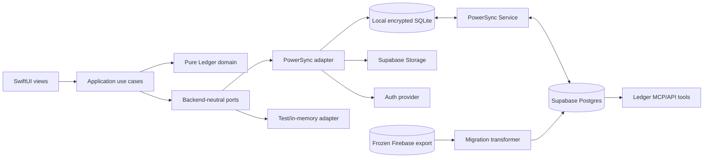

# Ledger Redesign Architecture

Status: proposed foundation for adoption
Architecture version: 0.1
Created: 2026-08-31
Last reviewed: 2026-09-04

This package defines the technical foundation for the redesigned Ledger app. It
describes a local-first application whose product and domain code do not depend
on Firebase, Supabase, PowerSync, or any other persistence vendor. The initial
target implementation uses Supabase Postgres as the server authority and
PowerSync SQLite as the local-first data plane. The currently shipped Firebase
system remains untouched production authority until cutover, then becomes a
frozen migration/rollback source. It is not an implementation of the new ports.

These documents are architecture authority, not permission to migrate
production. Production sequencing and product behavior remain subject to the
gates in the
[Ledger Accounting Redesign program](../../plans/ledger-accounting-redesign/README.md).

## Document Map

Read these in order:

1. [System Context and Principles](01-system-context-and-principles.md) — goals,
   quality attributes, system/container boundaries, trust boundaries, and
   dependency rules.
2. [Domain and Application Architecture](02-domain-and-application-architecture.md)
   — bounded contexts, commands, queries, operation lifecycle, invariants, and
   application-facing contracts.
3. [Data, Sync, and Offline Architecture](03-data-sync-and-offline.md) — data
   authority, local state, Sync Streams, conflicts, deletion, attachments, and
   offline guarantees.
4. [Backend Ports and Adapters](04-backend-ports-and-adapters.md) — Swift ports,
   the Supabase/PowerSync implementation, dependency injection, test adapters,
   and contract testing.
5. [Supabase and PowerSync Reference Architecture](05-supabase-powersync-reference.md)
   — Postgres schemas, command execution, PowerSync integration, Storage, Auth,
   and MCP topology.
6. [Security and Access Control](06-security-and-access-control.md) — principals,
   account membership, financial visibility, RLS, Sync Stream authorization,
   local-data protection, and privileged tooling.
7. [Migration, Release, and Cutover](07-migration-release-and-cutover.md) —
   environments, snapshot import pipeline, rehearsal, hard cutover, rollback,
   and Firebase retirement.
8. [Verification, Observability, and Operations](08-verification-observability-and-operations.md)
   — test architecture, fault cases, reconciliation, telemetry, service
   objectives, and operational runbooks.
9. [Architecture Decision Register](architecture-decisions.md) — decisions,
   alternatives, consequences, and decisions still requiring evidence.
10. [Product-to-Architecture Traceability](product-decision-traceability.md) —
    every confirmed D-001–D-027 and open O-002–O-050 mapped to its owning
    context, target surfaces, verification, and implementation block.
11. [Vertical Spike Protocol](../../plans/ledger-accounting-redesign/vertical-spike-protocol.md)
    — executable isolated tests, fixtures, evidence, thresholds, Auth/optimism
    comparisons, cost review, and go/no-go rules for A-003/A-004/A-007/A-015/
    A-016.

## Authority Boundaries

Different documents own different questions:

| Question | Authority |
|---|---|
| What should Ledger do for users? | Canonical product specs and the redesign decision log |
| How should Ledger be structured technically? | This architecture package |
| What work happens in what order? | Redesign implementation tracker and cutover plan |
| What does the shipped Firebase system currently do? | Current code, current-system specs, and production audits |
| Which observed behaviors should be preserved, corrected, improved, redesigned, or retired? | Reviewed capability dossiers under the [Capability Evolution Method](../../plans/ledger-accounting-redesign/conversion/capability-evolution-method.md) |
| What has actually been deployed? | Release manifests and environment evidence |

Architecture must not invent product behavior where the redesign decision log
has an open question. Product decisions must not prescribe Firebase- or
Supabase-shaped implementation details unless the behavior truly depends on
them.

Source coverage is not target design authority. A Firestore surface may reveal
a capability, migration dependency, defect, or obsolete mechanism. Before
target mapping, the owning capability dossier must distinguish the intended
outcome from accidental source mechanics and explicitly classify deliberate
corrections or improvements.

## Normative Language

The terms **must**, **must not**, **should**, and **may** are intentional:

- **must / must not** — required for architectural conformance;
- **should / should not** — default decision, with a documented exception
  required to diverge; and
- **may** — permitted option.

## Core Architecture in One View

The dependency arrows point inward from UI and infrastructure toward
application and domain contracts. Domain code never imports an SDK owned by a
backend vendor.

## Architectural Outcome

When this package is implemented:

- views express user intent through Ledger operations, not database calls;
- local queries remain usable without a network;
- an accepted offline operation survives process termination and restarts until
  it reaches a durable outcome or the user explicitly confirms destructive
  local-account removal;
- server-side accounting invariants are atomic and idempotent;
- the Supabase/PowerSync implementation passes the complete redesigned
  accounting, security, offline, and operational contract suite;
- privileged MCP and migration tools use the same domain rules as the app;
- authorization is enforced before sensitive data is downloaded and again
  when a write reaches Postgres;
- image bytes remain outside the structured sync stream; and
- changing a backend replaces adapters and deployment components rather than
  rewriting product behavior.

## Known Design Boundaries

This package deliberately does not finalize:

- paid-credit/refund settlement behavior;
- manual Invoice-adjustment sources and categorization;
- zero-dollar live Invoice lifecycle and collection behavior;
- exact Item occurrence and Transfer table columns;
- live-Invoice removal rules for Transfers and returns;
- the offline authorization lease duration;
- the exact optimistic-projection mechanism used for complex queued commands;
- the exact stale-Firebase-writer rejection/recovery mechanism at cutover;
- attachment reference removal versus permanent byte deletion/retention;
- non-cash vendor-credit/cancellation representation;
- Transaction posted/draft, void, and physical-deletion policy;
- receipt one-cent discrepancy and per-Item tax-basis behavior;
- actual Invoice-payment variance and sent-Invoice revision/delivery behavior;
- Client Summary financial meaning and client-shared receipt-evidence policy;
- Space archive behavior for currently assigned Items;
- final production PowerSync plan or self-hosting choice; or
- the final Supabase Auth cutover date.

Those choices are recorded as gates in the decision register and must be closed
with product decisions or a vertical technical spike before their dependent
schema or writer is implemented.

### Product-decision dependencies

| Architecture area | Product decision dependency |
|---|---|
| Item occurrence and Transfer evidence | Redesign O-007 and O-015 |
| Paid credit/refund and negative demand | O-003, O-004, and O-005 |
| Live Expense mutability | O-006 |
| Receipt-line billability | O-008 |
| Vendor cancellation/non-cash credit | O-028; no fourth target Transaction type |
| Transaction posted/draft, void and deletion | O-029 and O-032 |
| Receipt rounding and per-Item tax basis | O-030 and O-031 |
| Manual Invoice adjustment sources and categorization | O-009 |
| Zero-dollar live Invoice lifecycle and collection guard | O-010 |
| Whole-Invoice actual-payment variance | O-033; exact match is the provisional safe behavior |
| Sent-Invoice membership revision and delivery audit | O-034; source financial values remain live under D-011 |
| Client Summary paid/open/recognized meaning | O-035; current active-Item prices are not automatically paid spend |
| Client-shared receipt evidence and delivery links | O-036; no private path or expiring bearer URL in exports |
| Space archive and assigned Item placement | O-037; archived references remain resolvable pending final policy |
| Inventory destination planning | O-038; retention, granularity and lifecycle remain unapproved |
| Project-note text validation | O-039; app/MCP create/edit normalization, controls, size and minimum must converge before shared submission |
| Personal Project budget pinning | O-040; whether pins survive plus typed targets, missing/empty/no-pin defaults, Project-detail/card fallbacks, lifecycle and cleanup remain unapproved |
| Vendor-spend report semantics | O-041; payer perspective, scope, signs, posting/effective date, vendor credit, currency partition and exact label-snapshot grouping remain unapproved |
| Transfer versus live Invoice, Space, correction, and later Return | O-002 and O-011 through O-014 |
| Business-paid acquisition evidence and legacy proto migration | O-016 through O-020 |
| One-screen versus two-step Item wizard | O-021; UI-only and does not block domain/schema work |
| Legacy Firebase writer freeze/recovery at cutover | O-022 |
| Attachment reference/byte retention | O-023 |
| Project/Client/reference-data lifecycle | O-024 through O-026 |
| Unified Item minimum evidence | O-027 |
| Offline authorization duration | Architecture A-016 plus product/security approval |
| Complex optimistic projection | Architecture A-015 vertical spike |

## Conformance Rule

A new feature conforms to this architecture only when:

1. its capability dossier identifies preserved outcomes, deliberate changes,
   source evidence, specs, and acceptance tests;
2. its domain model contains no backend SDK types;
3. its user mutation is expressed as a typed Ledger operation or a documented
   simple-field mutation;
4. its read model is available from a local query port;
5. its authorization is enforced at the server boundary and sync-download
   boundary;
6. its offline, retry, idempotency, and conflict behavior is specified;
7. both authoritative and optimistic states are observable to the user; and
8. its adapter contract, security policy, and reconciliation tests exist.
